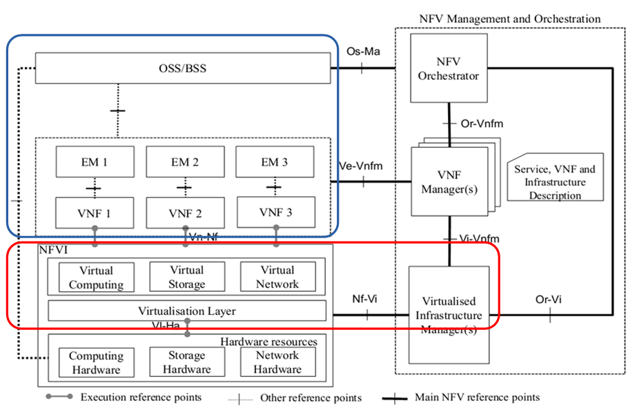

Reference Architecture
----------------------

This section describes the reference architecture, the function blocks,
and the function entities of Escalator for the reader to well understand how
the basic functions to be organized.

Upgrade Scope
~~~~~~~~~~~~~~~~

Upgrade objects described in this document are software programs covered by
red box in the picture below which includes: VIM and NFVI.
The target of the upgrade is to reduce the impact on the applications in the
blue box below as much as possible.
Note that this upgrade process does not take into consideration the effects
of Vi-Vnfm and Or-Vi. In other words, the unserviceability of the two
interfaces during upgrade can  be accepted.

The software stack on each node is generally as shown in the table below.

.. figure:: images/figure2.png
   :name: figure2
   :width: 100%

Because the control node upgrade will not affect the VNFs service in the blue
box, this scheme focuses on upgrading of compute nodes.

Precondition of Upgrade
~~~~~~~~~~~~~~~~~~~~~~~

1  The environmental requirements
^^^^^^^^^^^^^^^^^^^^^^^^^^^^^^^^^

1. System is running normally. If there are any faults before the upgrade,
it is difficult to distinguish between upgrade introduced and the environment
itself.

2. The environment should have the redundant resources. Because the upgrade
process is based on the business migration, in the absence of resource
redundancy,it is impossible to realize the business migration, as well as to
achieve a smooth upgrade.

Resource redundancy in two levels:

1  NFVI level: This level is mainly the compute nodes resource redundancy.
During the upgrade, the virtual machine on business can be migrated to another
free compute node.

2  VNF level: This level depends on HA mechanism in VNF, such as:
active-standby, load balance. In this case, as long as business of the target
node on VMs is migrated to other free nodes, the migration of VM might not be
necessary.

The way of redundancy to be used is subject to the specific environment.
Generally speaking, During the upgrade, the VNF's service level availability
mechanism should be used in higher priority than the NFVI's. This will help
us to reduce the service outage.

2 The requirements for component release version
^^^^^^^^^^^^^^^^^^^^^^^^^^^^^^^^^^^^^^^^^^^^^^^^

This is primarily a compatibility requirement. You can refer to Linux/Python
Compatible Semantic Versioning 3.0.0:

Given a version number MAJOR.MINOR.PATCH, increment the:

1. MAJOR version when you make incompatible API changes,

2. MINOR version when you add functionality in a backwards-compatible manner,

3. PATCH version when you make backwards-compatible bug fixes.

Some internal interfaces of OpenStack will be used by Escalator indirectly,
such as VM migration related interface between VIM and NFVI. So it is required
to be backward compatible on these interfaces. Refer to "Interface" chapter
for details.

Upgrade related modules in VIM
~~~~~~~~~~~~~~~~~~~~~~~~~~~~~~~~
Upgrade operations are initiated by the user through the VIM. For VIM, upgrade
management mainly contains the object:

- **Upgrade Manager**

Mainly responsible for control of the upgrade process.The Escalator is required
to know the software deployment information of the platform and will use these
information during the upgrading. It will be collected from some place, such
as the Installer, Deploy Manager and Escalator itself, etc.

- **VIM Interface**:

Mainly responsible for the external interface, include Vi-Vnfm, Or-Vi. This
module stores VNFO and VNFM external information such as address and
authentication.

- **Cloud Manager**:

Mainly responsible for virtualization resources management,which might be
considered made up of Openstack and SDN control node.

- **System Support**:

This layer is the runtime support environment of upper layers, e.g. Cloud
Manager and VIM interface., including:OS, HA, etc. To upgrade the upper
software is based on this module.

.. figure:: images/figure3.png
   :name: figure3
   :width: 100%