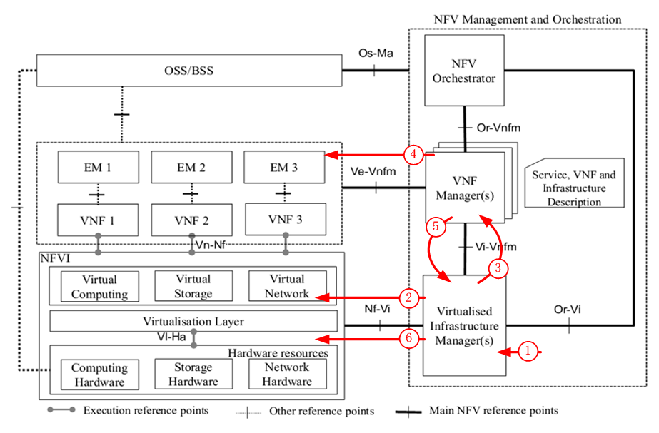
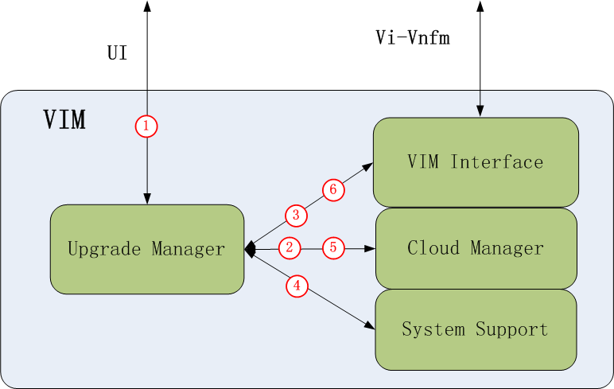
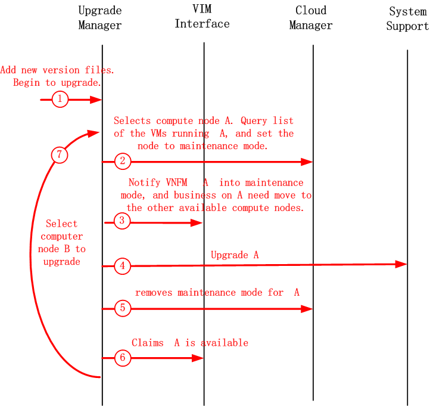

Information Flows
-----------------

This section describes the information flows among the function
entities when Escalator is in actions.

1. Upgrade process of Compute nodes

1.1 consider VIM as a whole

process is:
1. Operators add new version files on the VIM,initiate the upgrade.
2. VIM chooses some compute nodes as the upgrade target nodes, and set them
into maintenance mode. VIM queries the list of running VMs on target nodes.
3. VIM notice VNFM corresponding to  the virtual machine, to migrate the
business.
4. VNFM migrates the business. If the business is in active of active-standby
mode, it will initiate switch-over. If the business is in loading balance mode,
it will move the business to other node.
5. After VNFM moves business, it notifies the VIM.
6. VIM judges whether the business on the target VM has all been moved. If
not, VIM migrates the VM with business loaded to other free nodes. Then VIM
upgrades the target computer nodes. After upgrade, VIM set the target compute
nodes into normal nodes.
7. If there are computer nodes remained to be upgraded, goto step 2.

4.2 from inside VIM

process is:
1. Upgrade manager receives user operation commands. Add new version files.
Upgrade is began.
2. Upgrade Manager selects compute node A to Upgrade. Query list of the VMs
running the compute nodes A to the Cloud Manager, and set the node to
maintenance mode, that is to say creation or migration of new VM on this node
is impossible anymore.
3. Upgrade Manager notifies VNFM compute node A  into maintenance mode by VIM
interface, temporarily disabling the inserting of business, and business on
compute node A need move to the other available compute nodes.
4. When receives the VNFM reply, or waited for a timeout, Upgrade Manager
notifies the system support on compute node A to do software upgrade.
5. After upgraded, Upgrade Manager removes maintenance mode for the compute
node A.
6. Upgrade Manager claims VNFM computing nodes A available.
7. Select computer node B to upgrade