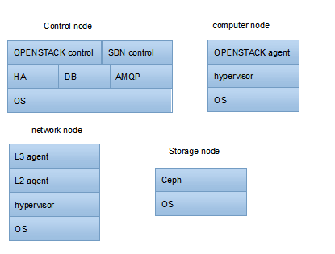
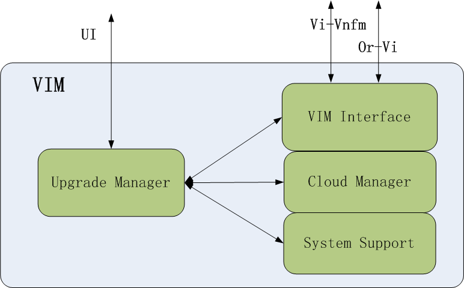

======================
Reference Architecture
======================

This section describes the reference architecture, the function blocks,
and the function entities of Escalator for the reader to well understand how
the basic functions to be organized.

The software stack on each node is generally as shown in the table below.

Since the upgrading of control node will not affect the VNFs service in the blue
box, this chapter will focusing on the upgrading of compute nodes.

Precondition of Upgrade
=======================

Upgrade related modules in VIM
~~~~~~~~~~~~~~~~~~~~~~~~~~~~~~~~

Upgrade operations are initiated by the user through the VIM. For VIM, upgrade
management mainly contains the object:

- **Upgrade Manager**

Mainly responsible for control of the upgrade process.The Escalator is required
to know the software deployment information of the platform and will use these
information during the upgrading. It will be collected from some place, such
as the Installer, Deploy Manager and Escalator itself, etc.

- **VIM Interface**:

Mainly responsible for the external interface, include Vi-Vnfm, Or-Vi. This
module stores VNFO and VNFM external information such as address and
authentication.

- **Cloud Manager**:

Mainly responsible for virtualization resources management,which might be
considered made up of Openstack and SDN control node.

- **System Support**:

This layer is the runtime support environment of upper layers, e.g. Cloud
Manager and VIM interface., including:OS, HA, etc. To upgrade the upper
software is based on this module.

